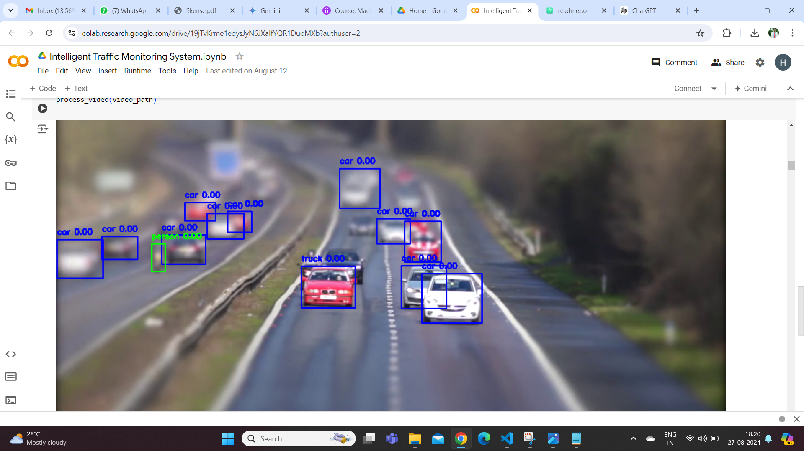
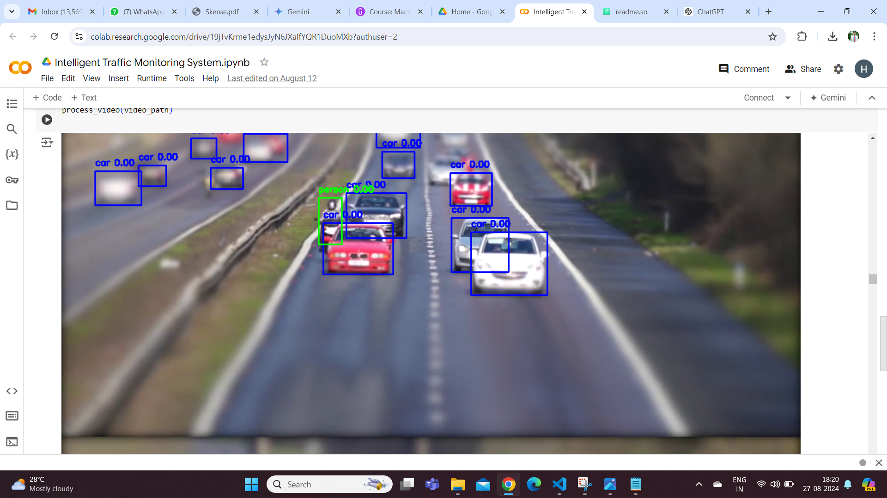

# Intelligent Traffic Monitoring System

Building an intelligent traffic monitoring system using computer vision in Python involves several key components, including video capture, object detection, tracking, and analysis.

## Objective

* Need to develop a computer vision system that can detect and track vehicles, pedestrians and other objects from real time CCTV footage or dashcam data.
* This could be used for traffic management, accident prevention and infrastructure planning.
* Because the system is entirely based on image processing, only the administrator should have access to it.

## Requirements

* Python Environment 3.7 or above version (PyCharm IDE)
* Required Libraries and Their Installation:

    -OpenCV (cv2)-a powerful library for computer vision tasks, including image and video processing, object detection, and more.

    -TensorFlow- a deep learning framework widely used for training and deploying machine learning models.

    -PyTorch-PyTorch is another popular deep learning framework known for its dynamic computational graph and ease of use.

    -NumPy-NumPy is a fundamental library for numerical computing in Python, providing support for arrays and matrices, along with a collection of mathematical functions to operate on these arrays.
    
    -imutils- a collection of convenience functions for basic image processing tasks, such as resizing, rotating, and displaying images.

```bash
# Install necessary libraries
pip install opencv-python
pip install opencv-python-headless
pip install tensorflow
pip install torch torchvision
pip install numpy
pip install imutils
```

## Screenshots

```bash
python ITMS.py # go to directory where python file is saved 
```
I uploaded video for detecting vehicle, person and others.
The bounding box i created around objects and displayed framewise.
2 of the multiple frames with different time stamp is given below:-





## Scope for Improvements

License Plate Recognition: Need to use OCR tools like Tesseract or cloud-based solutions to recognize text on license plates.

Traffic Flow Analysis: Need to implement ML/DL algorithms to calculate traffic density and flow rate.

Anomaly Detection: Need to use machine learning algorithms to detect unusual behavior or patterns.

Performance: For real-time performance, especially on live feeds, consider using GPU acceleration and optimizing the model.

Customization: Modify confidence thresholds, model paths, or tracking algorithms according to your project needs.