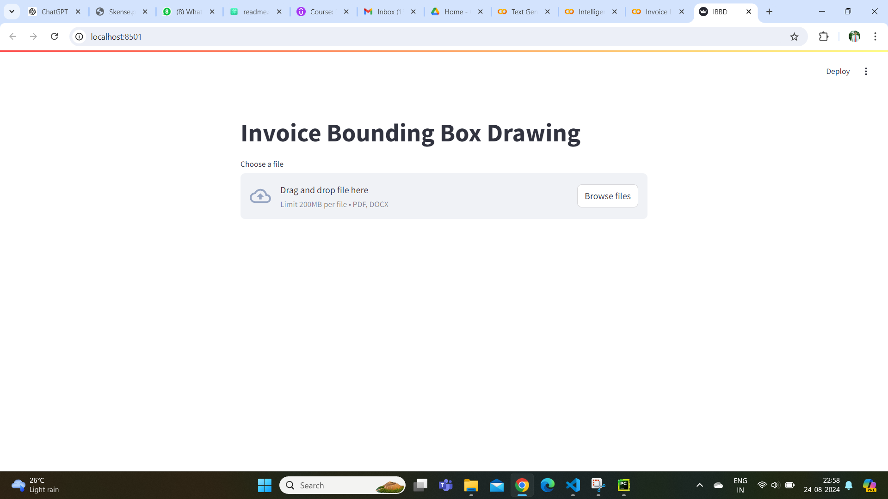

# Invoice Bounding Box Drawing

An invoice is a document that maintains a record of a transaction between a buyer and seller, such as a paper receipt from a store or an online record from an e-tailer.
Invoices generally outline payment terms, unit costs, shipping, handling, and any other terms outlined during the transaction.
This project streamlines the extraction of key information, making it more efficient.

## Features

* Take any Invoice in pdf or word document

* Draw bounding box for key important fields and table using opencv, use different colours for different section

* Use streamlit UI to show output.
## Requirements

* Python Environment (Python 3.7 or later)
* Required Python Packages:

    -streamlit: To create the web application interface.

    -pdfplumber: To extract text and images from PDF files.

    -opencv-python-headless: To process images without GUI functionality.

    -numpy: To handle image arrays.

    -pillow (PIL): To manipulate images in Python.

    -python-docx: To read DOCX files.

    -pytesseract: To perform Optical Character Recognition (OCR) 
    on images.
* [Tesseract-OCR](https://github.com/UB-Mannheim/tesseract/wiki)
    A separate OCR engine used by pytesseract to perform text recognition.

    Add the Tesseract installation path to your system’s environment variables. This path is like C:\Program Files\Tesseract-OCR.


```bash
pip install streamlit pdfplumber opencv-python-headless numpy pillow python-docx pytesseract
```

## Screenshots

To run the Streamlit app, navigate to the directory containing your Python script in the terminal or command prompt and execute:


```bash
streamlit run IBBD.py
```


This is the streamlit UI of Invoice Bounding Box Drawing web application.

* extract_pdf_info(pdf_path):
Extracts text and word positions from the first page of a PDF.
Converts the first page to a high-resolution image.
Returns the extracted text, words, and image.

* extract_docx_info(docx_path):
Extracts all text from a DOCX file.
Creates a blank image and draws the extracted text onto the image.
Returns the extracted text and the image with text drawn on it.


* Get Image Dimensions: The height h, width w, and the number of channels _ (typically 3 for RGB) of the image are determined using img.shape.

* Text Detection with Tesseract:
The function uses pytesseract.image_to_data() to detect text within the image. This function returns a dictionary (boxes) with various details about detected text elements, such as their position and recognized text.
Define Regular Expressions:

* Regular expressions are defined for detecting dates (date_pattern), numbers (number_pattern), and percentages (percentage_pattern). These patterns help in identifying specific formats of text that need to be highlighted.

* Draw Bounding Boxes:
For each detected text element (looping through n_boxes), the function retrieves the position (x, y) and size (bw, bh) of the bounding box for that text.It checks if the detected text matches any of the defined patterns (dates, numbers, percentages) using re.search and re.match. If a match is found, it uses OpenCV (cv2.rectangle) to draw a blue bounding box around the text. If no match is found, it draws a red bounding box.


In above 2 examples we saw dates, amount bounded with red color and texts bounded with blue color.

## Conclusion

Streamlit is a promising open-source Python library, which enables developers to build attractive user interfaces in no time.
OpenCV is an open-source computer vision and machine learning software library to process images without GUI functionality.
Tesseract is an open source optical character recognition (OCR) platform. OCR extracts text from images and documents without a text layer and outputs the document into a new searchable text file, PDF, or most other popular formats.