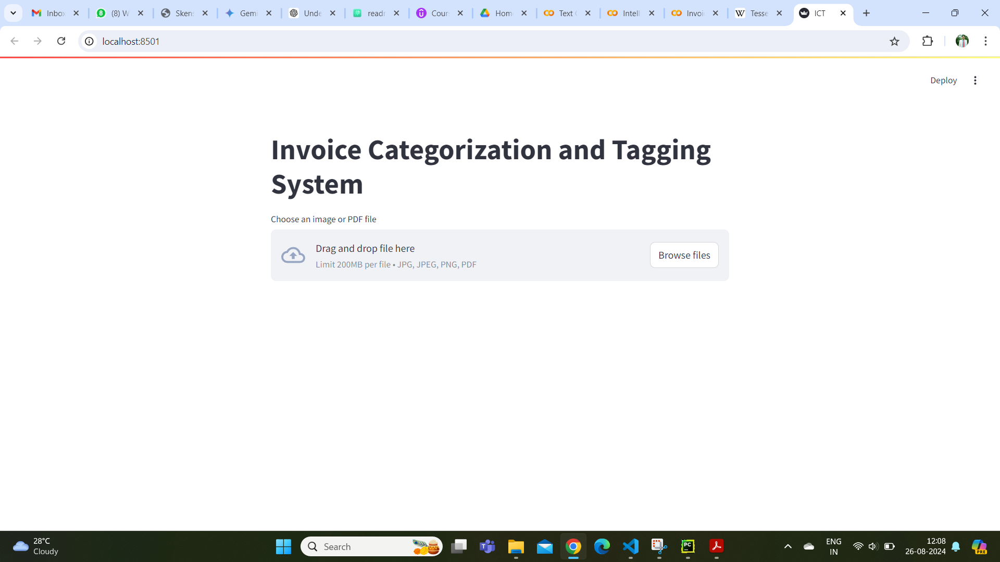
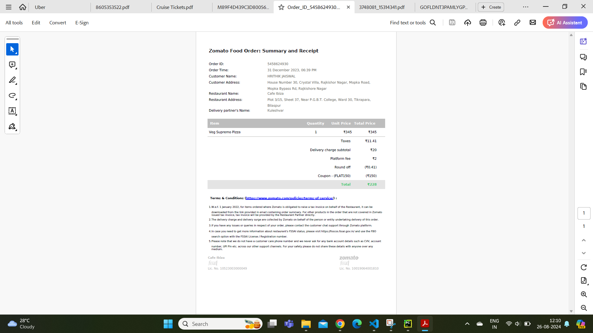
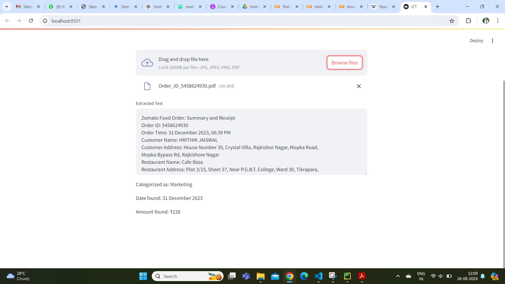
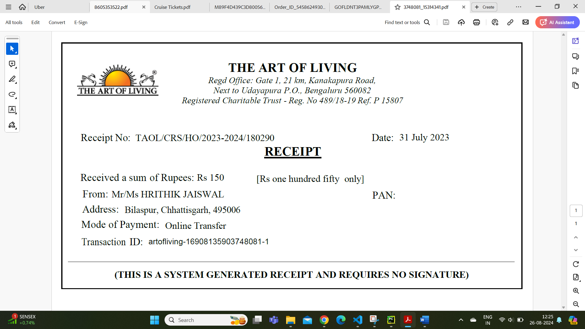
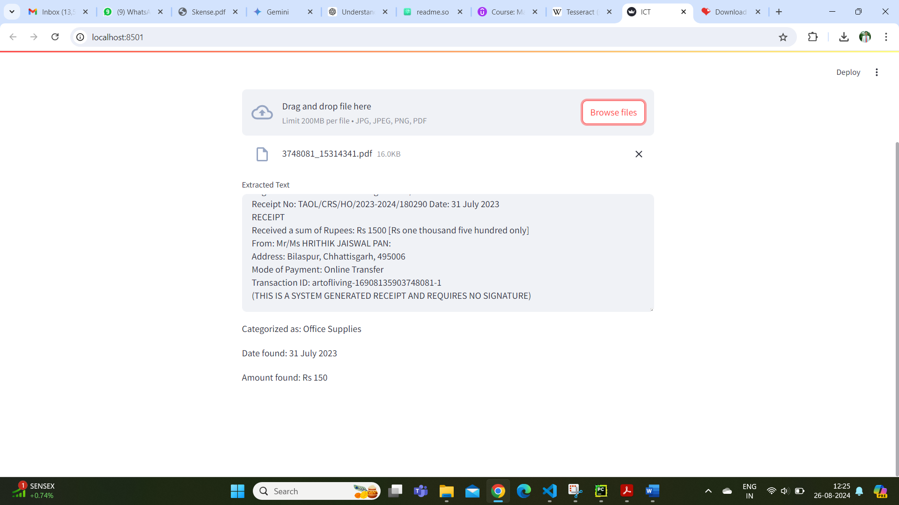

# Invoice Categorization and Tagging

An invoice is a document that maintains a record of a transaction between a buyer and seller, such as a paper receipt from a store or an online record from an e-tailer.
Invoices generally outline payment terms, unit costs, shipping, handling, and any other terms outlined during the transaction.
We need system that can categorize and tag invoices based on their content such as expense type, department or project.


## Features

* Take any Invoice in pdf or word document

* This project streamlines cost amount, date of transaction and categorize the invoice as office supplies, marketing, travel or software with help of natural language processing.

* This project can assist in organizing and managing invoices more efficiently, improving financial tracking and reporting.


## Requirements

* Python Environment (Python 3.6 or later)
* Required Python Packages:

    -PIL (Pillow): A Python Imaging Library (PIL) fork, used for opening, manipulating, and saving different image file formats.

    -pdfplumber: A Python library for extracting information from PDF files.

    -nltk: The Natural Language Toolkit, used for natural language processing tasks such as tokenization and stopword removal.

    -scikit-learn: A machine learning library used for tasks such as text classification with the Naive Bayes classifier.

    -transformers: to leverage the power of a pre-trained model for text categorization, which should improve accuracy and handle a wider range of inputs compared to a simple Naive Bayes model trained on a small dataset.

    -Streamlit: A library for creating web applications in Python.

    -pytesseract: To perform Optical Character Recognition (OCR) 
    on images.
* [Tesseract-OCR](https://github.com/UB-Mannheim/tesseract/wiki)
    A separate OCR engine used by pytesseract to perform text recognition.

    Add the Tesseract installation path to your system’s environment variables. This path is like C:\Program Files\Tesseract-OCR.


```bash
pip install streamlit pdfplumber opencv-python-headless numpy pillow python-docx pytesseract
```
```bash
pip install transformers
```


## Screenshots

Opening terminal and run the .py file as given below :-

```bash
streamlit run ICT.py
```




Given below image is the Streamlit web interface:

Set Title: Displays a title for the web app.

File Uploader: Provides an interface to upload files (images or PDFs).

Check for Uploaded File: Executes the following only if a file is uploaded:



Text Preprocessing Function : Convert to Lowercase, Remove Numbers-Uses regular expressions to remove all digits from the text, Remove Non-Word Characters-Removes any non-alphanumeric characters, Remove Extra Spaces, Remove Stop Words (like "the," "and," etc.), Tokenize Text, Joins the filtered words back into a single string and returns it.

Sample Categories : A list of sample categories that the text might be classified into.The transformers library is used to load a pre-trained model (facebook/bart-large-mnli) for zero-shot text classification.

Training the Machine Learning Model : Uses make_pipeline to create a machine learning pipeline that includes:
TfidfVectorizer: Converts text data into numerical features using Term Frequency-Inverse Document Frequency.
MultinomialNB: A Naive Bayes classifier suitable for discrete features like word counts.

Categorization Function : It returns the predicted category.

Entity Tagging Function : Define Date Patterns, Find Dates, Define Amount Patterns, Find Amounts, Format Amounts(Removes commas from amounts to standardize them)
Return Entities: Returns the first detected date and the last detected amount.



As shown above after uploading my food bill, application categorized it as Marketing with amount Rs 228 and date 31 December 2023 also extarcted.



Another bill with donation cause. 



As shown above after uploading my food bill, application categorized it as Office Supplies with amount Rs 150 and date 31 July 2023 also extarcted.

## Conclusion

With the help of streamlit open source framework and natural language processing libraries key information of invoices are extracted in terms of department category, bill amount and transaction date.