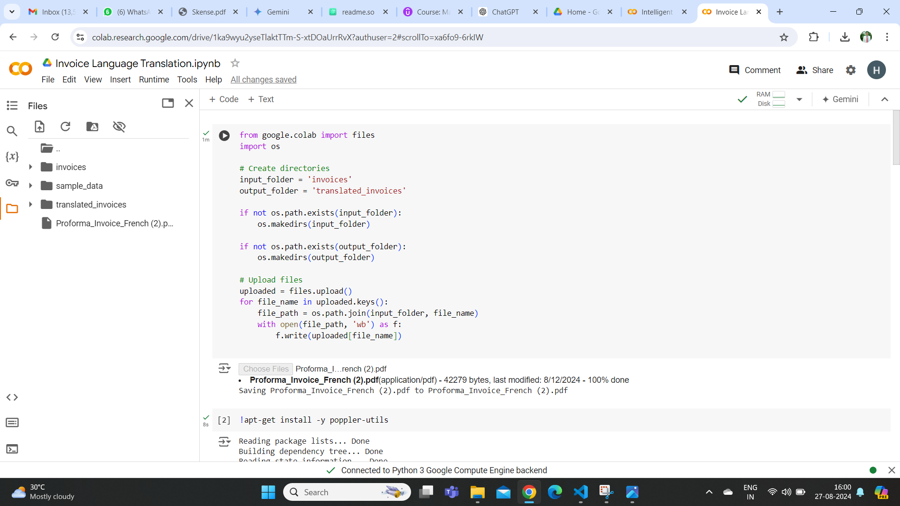
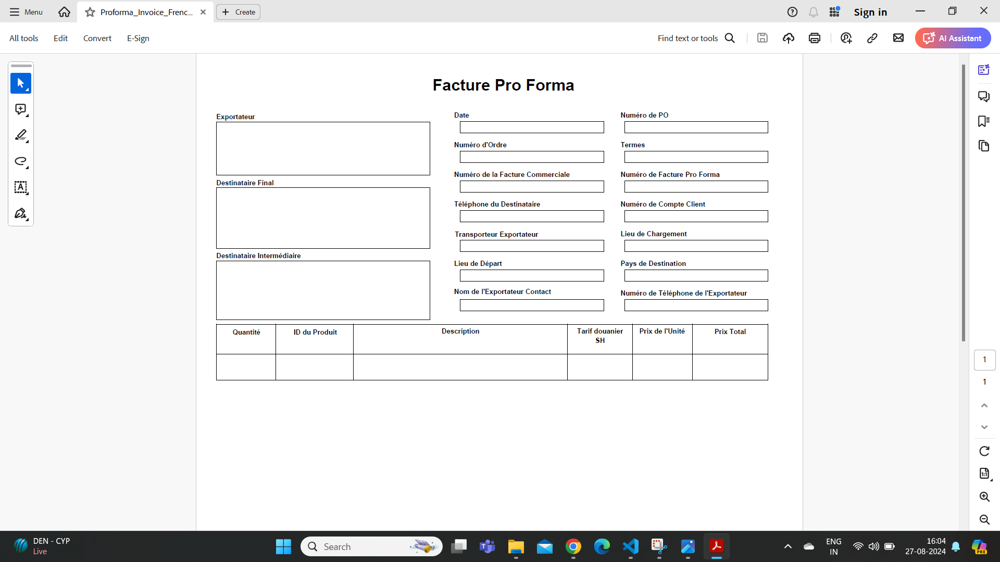
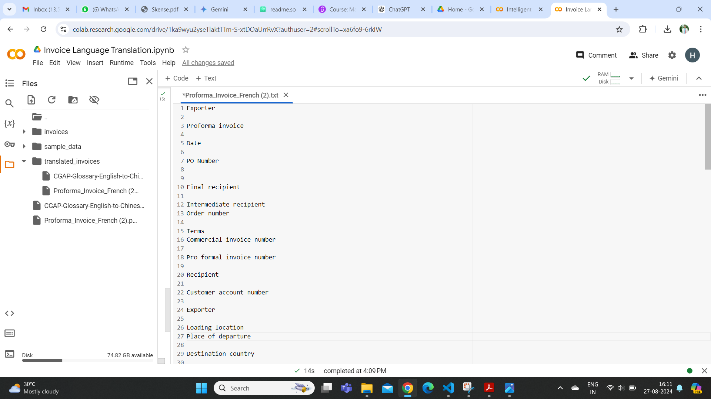
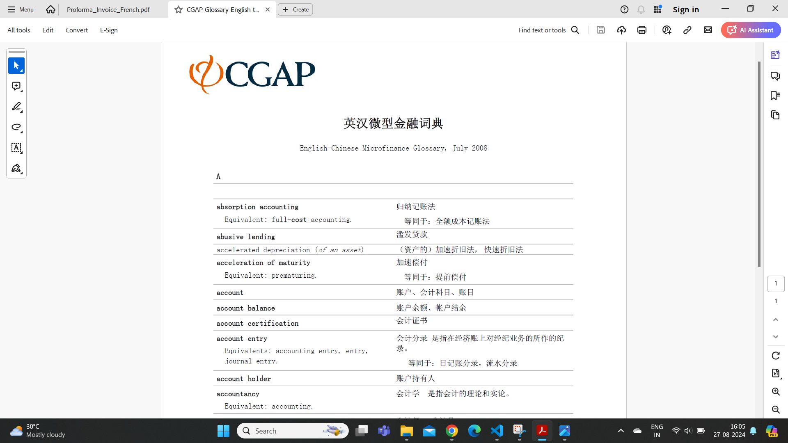
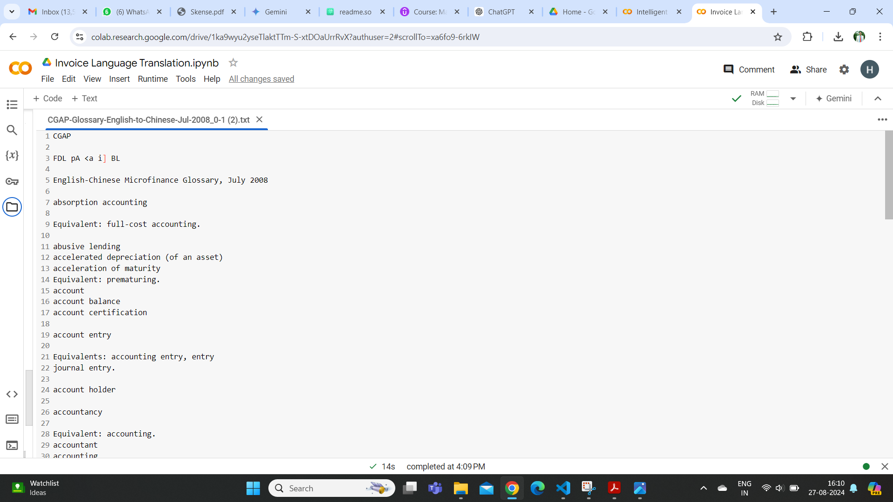

# Invoice Language Translation

There are huge number of invoices generated across the globe. Different country has different language to generate invoice so it become difficult to track goods, do analysis and do modifications. Henceforth, we need project that will translate all invoices with different languages into common language which is english in our case.

## Features

* There is an upload option in the application(Google Colab in our case) where it is required to upload invoice (in pdf form).
* The program will tranlate the invoice and produce translated invoice (in english) in .txt format.

## Requirements

* Python Environment (Google Colab)
* Required Libraries and Their Installation:

    -pytesseract - Python wrapper for Google's Tesseract-OCR Engine. It allows you to perform Optical Character Recognition (OCR) on images, extracting text from images.

    -pdf2image - Python library that converts PDF documents into images. This can be useful when you need to perform OCR on PDF files, as pytesseract requires an image input.

    -langdetect - language detection library in Python. It is a port of Google's language-detection library.

    -googletrans - Python library that interfaces with the Google Translate API, allowing you to translate text between different languages.

    -PIL (Python Imaging Library) - used for opening, manipulating, and saving many different image file formats.

    -os - module provides a way of using operating system-dependent functionality like reading or writing to the file system.


```bash
!apt-get install -y poppler-utils
!apt-get update
!apt-get install -y tesseract-ocr
!apt-get install -y libtesseract-dev
!pip install pytesseract
!pip install pdf2image
!pip install langdetect
!pip install googletrans==4.0.0-rc1
!pip install pillow
```

## Screenshots



In Google Colab we run project and uploaded invoice in pdf as shown above.



This is the invoice in french.



The program converts it to english and gives .txt file.



The above invoice is in chinese.



The program converts it to english and gives .txt file.

## Conclusion

Workflow:-

* Input Folder: The script assumes there's a folder named 'invoices' containing files to be processed.
* Output Folder: The script checks if a folder named 'translated_invoices' exists. If not, it creates this folder to store the translated text files.
* File Processing:
Iterates over each file in the input_folder.
Extracts text from an image file using Optical Character Recognition (OCR).
Detects the language of the input text and translates it to a target language if necessary.
Processes a file (PDF or image), extracts text, detects its language, and translates it to English (or any specified target language).
* For each file:
Constructs the full file path.
Writes the translated text to a new .txt file in the output_folder.
Prints a success message for each processed file.
If an error occurs during processing, it prints an error message for that file.