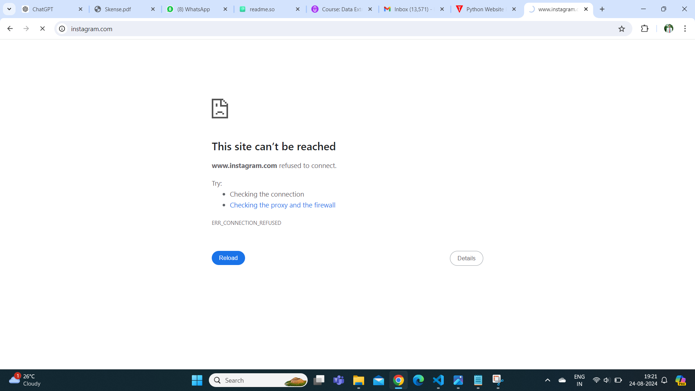

# Python Website Blocker

The Python Website Blocker invloves creating a Python script that can block certain websites based on user input.

## Features

* User Input - Allows users to input the websites they want to block.
* Date Specific - We can also specify the date until when the website needs to be blocked, but that needs to be mentioned in the code.

## Requirements

* python 3.x
* IDE (any) 
* Command Prompt ( To be run as administrator)

## Screenshots

Open command prompt and run it as administrator.
Go to the directory where python file(MPWB.py) is saved and run it as given below :-

It asked us to given input of websites that we want to block.
We wrote :-

facebook.com

instagram.com

and at last wrote "done".

As shown above we are unable to access facebook.com and instagram.com.

## Conclusion

Each website in the "site_block" list is formatted in two versions: one with "www." at the beginning and one without. It appends these formatted versions back into the site_block list.
"host_path" is the path to the hosts file on a Windows system. This file is used by the operating system to map hostnames to IP addresses.
"redirect" is the IP address to which blocked websites will be redirected. 127.0.0.1 is the localhost IP, meaning any request to a blocked website will not reach its intended destination and instead point to the user's own computer.
If the current date and time is after end_time, the script unblocks the websites.