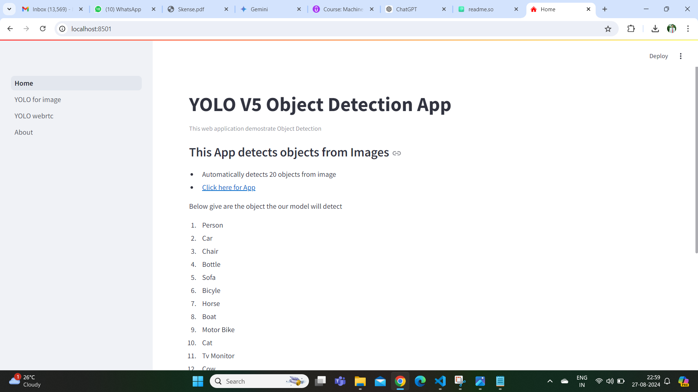
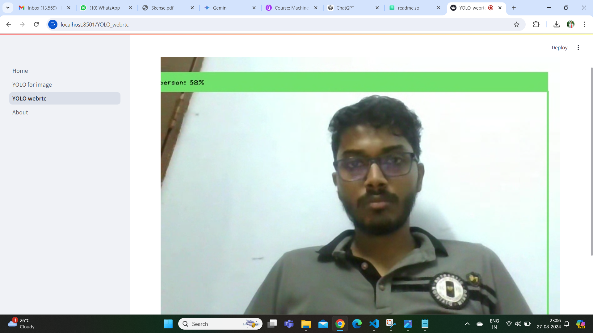
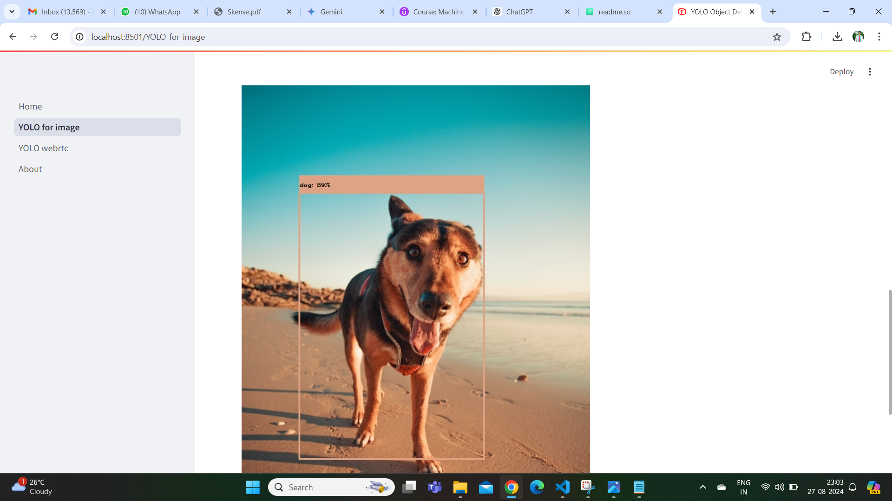
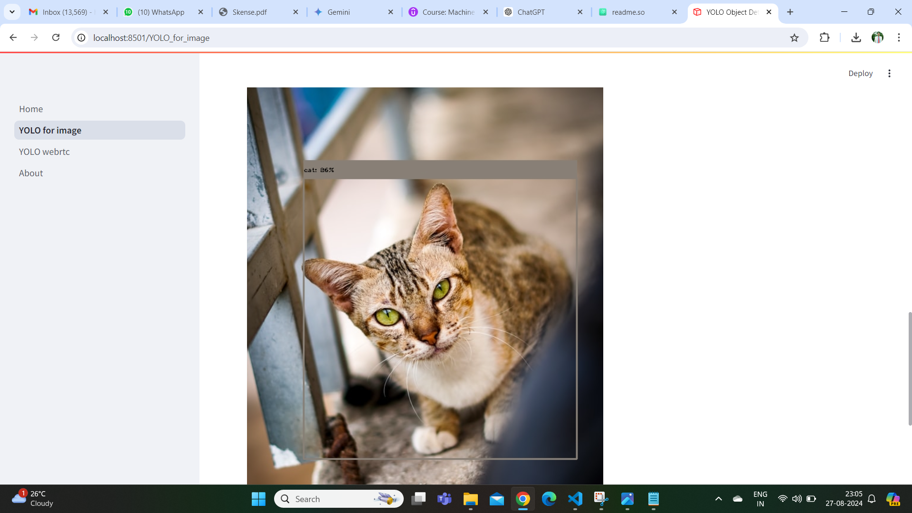

# Real Time Object Detection

Real-Time Object Detection is a computer vision task that involves identifying and locating objects of interest in real-time video sequences with fast inference while maintaining a base level of accuracy.

## Features

* Built Flask Web app that uses machine learning algorithm (YOLO in this case) to detect objects in real time.
* Model used can detect 20 distinct objects.
* There is 2 options for object detection for images and for camera video recording on real time.

## Requirements

* Python Environment 3.7 or above version (VS Code IDE)
* Required Libraries and Their Installation:

    -OpenCV -a powerful library for computer vision tasks, including image and video processing, object detection, and more.

    -PIL (Python Imaging Library): Now maintained under Pillow, used for image processing.

    -NumPy: For numerical operations, especially for handling image arrays.

    -os: A standard Python library for interacting with the operating system, used for file path manipulations.

    -YAML(Yet Another Markup Language): For loading configuration files, such as model class names and the number of classes.

    -Streamlit: A library for creating web apps for machine learning and data science.

    -av: A Python binding for FFmpeg libraries, which is used to handle video and audio streams.

```bash
# Install necessary libraries
pip install pyyaml
pip install streamlit
pip install av
pip install pillow
pip install numpy
pip install opencv-python
```
## Screenshots
    
```bash
streamlit run Home.py
```


Interface for web app with 2 options to detect image and real time video capturing through camera.



Real time Object Detection as shown above its me.

-Model Initialization: Loads a YOLO object detection model in ONNX format and reads class information from a YAML file.

-Image Processing: Prepares an image for object detection by converting it into a square format.



-Object Detection: Uses the YOLO model to detect objects in the image, applying confidence filtering and non-maximum suppression to refine detections.

-Confidence and Probability Thresholds-Filters out detections with low confidence (<0.4) and class probability (<0.25).

-Bounding Box Calculation-Computes bounding box coordinates from predictions.

-Visualization: Draws bounding boxes and class labels on the image for the detected objects.



Detection of cat and dog.

## Conclusion

The YOLO_Pred class is designed to load a YOLO model in ONNX (Open Neural Network Exchange) format and perform object detection on images. The class handles image pre-processing, model inference, filtering detections based on confidence scores, applying non-maximum suppression to remove redundant detections, and drawing bounding boxes and labels on the image. 
Non-Maximum Suppression (NMS) is applied to remove overlapping bounding boxes that refer to the same object, keeping only the most confident ones.
This is useful for tasks where real-time object detection is required, such as surveillance, autonomous driving, and various other computer vision applications.