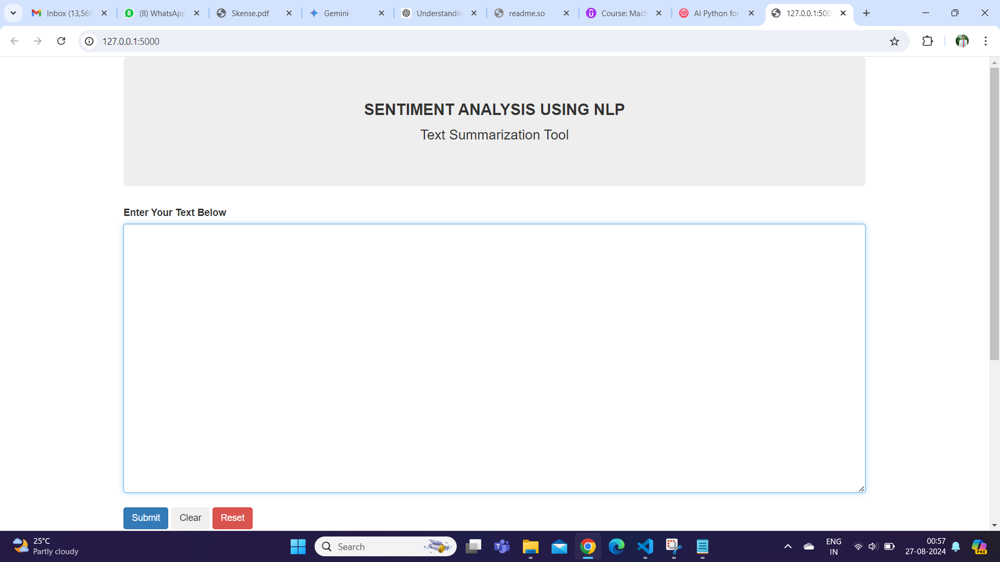
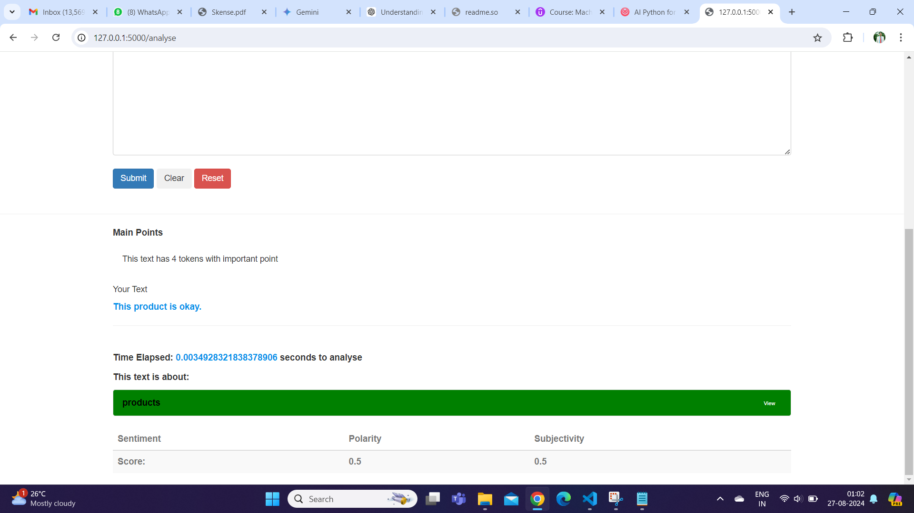

# Sentiment Analysis Web App

Customer feedback is information that customers share about their experiences with a company, product, or service. It can include insights, opinions, reactions, preferences, and complaints. It is important for businesses because it can help them improve the customer experience, increase customer loyalty, and drive referrals.

Sentiment Analysis inspects the given text and identifies the prevailing emotional opinion within the text, especially to determine a writer's attitude as positive, negative, or neutral.

## Features

* Sentiment Analysis: Analyze text data to determine the sentiment (positive, negative, neutral) of the text.

* With help of natural language processing this objective is achieved with parameters of Subjectivity and Polarity.

* Sentiment Polarity Score (blob_sentiment):
    
    The sentiment polarity score measures the emotional tone of the text. It is a value that typically ranges from -1 to 1.

    -1: Represents a very negative sentiment.

    0: Represents a neutral sentiment.

    1: Represents a very positive sentiment.

* Subjectivity Score (blob_subjectivity):
    The subjectivity score measures how subjective or objective the text is. It is a value that typically ranges from 0 to 1.

    0: Represents completely objective text, containing factual information without personal opinions.
    
    1: Represents completely subjective text, containing personal opinions, emotions, or biases.

## Requirements

* Python Environment (Python 3.6 or later)
* Required Libraries and Their Installation:

Flask: A web framework for Python.
```bash
pip install Flask
```
Flask-Bootstrap: A library to integrate Bootstrap with Flask for easier web styling.
```bash
pip install Flask-Bootstrap
```
TextBlob: A simple NLP library for processing textual data.
```bash
pip install textblob
```
nltk: The Natural Language Toolkit, a library for processing and analyzing human language data.
```bash
pip install nltk
```

* Project Structure

```bash
SENTIMENTANALYSIS/
|-- app.py  # The main Flask application
|-- templates/
|   |-- index.html  # Your HTML template
```

## Screenshots

```bash
cd my_env # Opening Virtual Environment
Scripts/activate # Activating Virtual Environment
cd.. # Going back to directory where python file is stored
python app.py # executing python file
```



UI of Sentimental Analysis for customer feedback.

Positive Sentiment: If the sentiment score is closer to 1, it indicates that the customer feedback is positive. This means that the customer is likely expressing satisfaction, happiness, or approval. For example, "I love this product! It's fantastic!" would yield a high positive score.

Negative Sentiment: If the sentiment score is closer to -1, it indicates that the feedback is negative. This suggests that the customer is dissatisfied, frustrated, or unhappy. For instance, "This service is terrible, I'm very disappointed" would yield a high negative score.

Neutral Sentiment: A sentiment score around 0 indicates neutral feedback, where the customer is not expressing strong emotions, either positive or negative. For example, "The product arrived on time" is a neutral statement. 


High Subjectivity: If the subjectivity score is closer to 1, it indicates that the feedback is more subjective. This means that the customer is likely expressing personal opinions, feelings, or beliefs. For example, "I think this is the best app ever!" is highly subjective.

Low Subjectivity: If the subjectivity score is closer to 0, it indicates that the feedback is more objective, based on facts or observations rather than personal feelings. For example, "The device has a 10-hour battery life" is an objective statement.



## Conclusion

With the help of flask and nlp sentimental analysis for customer feedback is made through web app.
